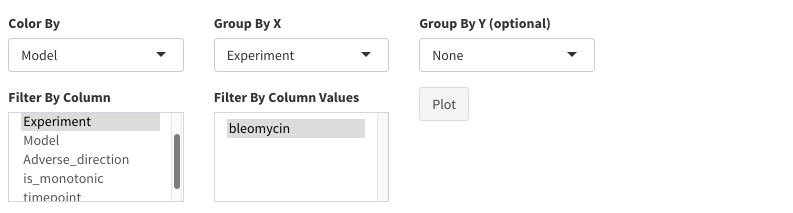
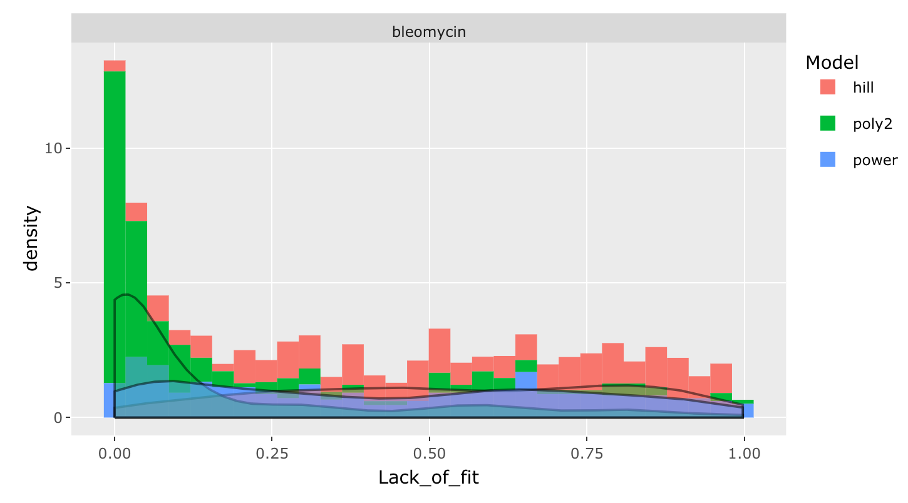

#Compare different experiments

Once the models have been fitted their distribution across different experiments and different time-points can be explored by different visualizations. 

### BMD histograms

The density distribution of the BMD values can be investigated by means of histograms. The user can select the relevant variable of interest and different grouping variables. Filtering can be also performed to plot only a subset of the results.

The following parameters are required:

- **Color by:** how the bmd values are going to be colored. This should be a factor variable whose levels will be used to fill the legend
- **Group by X:** the bmd values can be grouped by a factor variable
- **Group by Y (optional):** the bmd values can be grouped by another optional factor variable to perform a grid plot
- **Filter by Column:** Can be used to investigate the bmd distribution of specific variable of interest. Default is None which means that no filtering is applied. However, if one of the column names is selected the **Filter by Column Values** window is populated by the possible column values. When one of those is selected, only the bmd corresponding to the genes characterized by those values are investigated (e.g. only the bmd produced by a specific model).

### Fitting statistics

The distribution of the lack-of-fit p-values, AIC, and $R^2$ can be investigated by means of histograms. The user can select the relevant variable of interest and different grouping variables. Filtering can be also performed to plot only a subset of the results.

The following parameters are required:

- **Color by:** how the bmd values are going to be colored. This should be a factor variable whose levels will be used to fill the legend
- **Group by X:** the bmd values can be grouped by a factor variable
- **Group by Y (optional):** the bmd values can be grouped by another optional factor variable to perform a grid plot
- **Filter by Column:** Can be used to investigate the bmd distribution of specific variable of interest. Default is None which means that no filtering is applied. However, if one of the column names is selected the **Filter by Column Values** window is populated by the possible column values. When one of those is selected, only the bmd corresponding to the genes characterized by those values are investigated (e.g. only the bmd produced by a specific model).

### BMD/BMDL
The relationship between the BMD/BMDL values can be investigated by means of scatterplots. The user can select the relevant variable of interest and different grouping variables. Filtering can be also performed to plot only a subset of the results.
The following parameters are required:

- **Color by:** how the bmd values are going to be colored. This should be a factor variable whose levels will be used to fill the legend
- **Group by X:** the bmd values can be grouped by a factor variable
- **Group by Y (optional):** the bmd values can be grouped by another optional factor variable to perform a grid plot
- **Filter by Column:** Can be used to investigate the bmd distribution of specific variable of interest. Default is None which means that no filtering is applied. However, if one of the column names is selected the **Filter by Column Values** window is populated by the possible column values. When one of those is selected, only the bmd corresponding to the genes characterized by those values are investigated (e.g. only the bmd produced by a specific model).

### Fitted models
The proportion of fitted models can be investigated by means of pie charts. The user can select different grouping variables. Filtering can be also performed to plot only a subset of the results. In this plot the variable of interest is fixed to the models and cannot be changed by the user.

The following parameters are required:

- **Group by X:** the bmd values can be grouped by a factor variable
- **Group by Y (optional):** the bmd values can be grouped by another optional factor variable to perform a grid plot
- **Filter by Column:** Can be used to investigate the bmd distribution of specific variable of interest. Default is None which means that no filtering is applied. However, if one of the column names is selected the **Filter by Column Values** window is populated by the possible column values. When one of those is selected, only the bmd corresponding to the genes characterized by those values are investigated (e.g. only the bmd produced by a specific model).

### Number of dose-dependent genes
The proportion of dose-dependent genes by time points can be investigated by means of barplots. The user can select the grouping variable. Filtering can be also performed to plot only a subset of the results. In this plot the variable of interest is fixed to the time point and cannot be changed by the user.

The following parameters are required:

- **Group by X:** the bmd values can be grouped by a factor variable
- **Filter by Column:** Can be used to investigate the bmd distribution of specific variable of interest. Default is None which means that no filtering is applied. However, if one of the column names is selected the **Filter by Column Values** window is populated by the possible column values. When one of those is selected, only the bmd corresponding to the genes characterized by those values are investigated (e.g. only the bmd produced by a specific model).

### ECDF
The distribution of the bmd values at the whole transcriptome level can be investigated by means of the ECDF plot. This plot is showing the percentage of genes (y-axis) with a bmd lower than a certain value (x-axis). The user can select the relevant variable of interest and different grouping variables. Filtering can be also performed to plot only a subset of the results.
The following parameters are required:

- **Relevant variable:** how the bmd values are going to be colored. This should be a factor variable whose levels will be used to fill the legend
- **Group by X:** the bmd values can be grouped by a factor variable
- **Numeric grouping variable:**: If true the variable is considered numerical and ordered accordingly 
- **Other variables (optional):** the bmd values can be grouped by another optional factor variable to perform a grid plot
- **Filter by Column:** Can be used to investigate the bmd distribution of specific variable of interest. Default is None which means that no filtering is applied. However, if one of the column names is selected the **Filter by Column Values** window is populated by the possible column values. When one of those is selected, only the bmd corresponding to the genes characterized by those values are investigated (e.g. only the bmd produced by a specific model).
- **Scale bmd:** If selected, the bmd of different experiments (that might be in different ranges) are scaled in the range [0-1] to make them comparable.

### Upset Plot
The number of genes shared by the different experiments can be investigated by means of an upset plot.  The user can select the relevant variable of interest and different grouping variables. Filtering can be also performed to plot only a subset of the results.
The following parameters are required:

- **Relevant variable:** how the bmd values are going to be colored. This should be a factor variable whose levels will be used to fill the legend
- **Group by X:** the bmd values can be grouped by a factor variable
- **Numeric grouping variable:**: If true the variable is considered numerical and ordered accordingly 
- **Other variables (optional):** the bmd values can be grouped by another optional factor variable to perform a grid plot
- **Filter by Column:** Can be used to investigate the bmd distribution of specific variable of interest. Default is None which means that no filtering is applied. However, if one of the column names is selected the **Filter by Column Values** window is populated by the possible column values. When one of those is selected, only the bmd corresponding to the genes characterized by those values are investigated (e.g. only the bmd produced by a specific model).
- **Maximum intersection:** Maximum number of intersection to show
- **GroupBy:** UpsetPlot parameter
- **OrderBy:** UpsetPlot parameter

