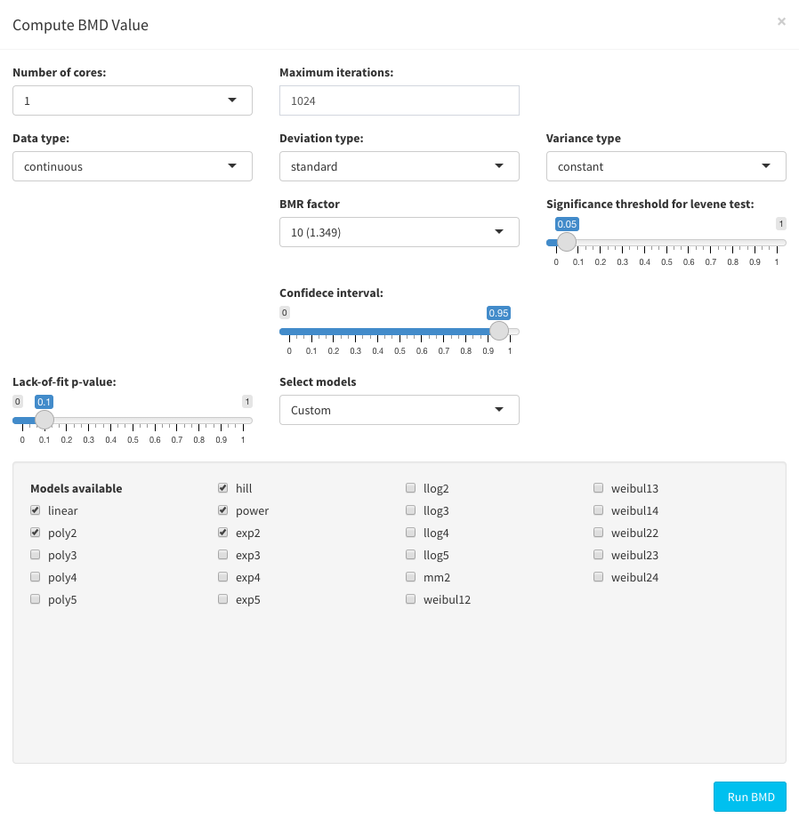

## Selection of Parameters for bmd modelling

The BMD analysis requires the following parameters: 

- **Number of cores:** The number of cores that are used during the analysis
- **Maximum Iterations:** Is the maximum number of iterations allowed as a convergence criteria
- **Data type:** Is a string character describing the type of response. Possible values are continuous (default) and binomial
- **Deviation type:** Is a string character describing the type of deviation computed. Possible values are standard (default) and relative and absolute. 
- **BMR factor:** Is the number of standard deviation at which the BMD is defined. The default value is 1.349, which corresponds to a change of 10% with respect to the controls. For further information refer to the following papers: Thomas, Russell S, Bruce C Allen, Andy Nong, Longlong Yang, Edilberto Bermudez, Harvey J Clewell, and Melvin E Andersen. 2007. “A Method to Integrate Benchmark Dose Estimates with Genomic Data to Assess the Functional Effects of Chemical Exposure.” Toxicological Sciences 98 (1): 240–48. https://doi.org/10.1093/toxsci/kfm092; Filipsson, Agneta Falk, Salomon Sand, John Nilsson, and Katarina Victorin. 2003. “The Benchmark Dose Method--Review of Available Models, and Recommendations for Application in Health Risk Assessment.” Critical Reviews in Toxicology 33 (5): 505–42. https://doi.org/10.1080/10408440390242360.

- **Confidence interval:** The statistical confidence limit applied to the BMD estimated from the models.  
- **Variance type:** Is a string character describing the type of variance of the data. Possible values are constant (default), non constant, model and inferred.
- **Significance threshold for levene test:** In case of variance type equal to inferred, a levene test is used to test the assumption of constant or non constant variance. This parameter specify the threshold for the significant p-value for the test. Default value is 0.05.
- **Lack-of-fit p-value:** Threshold used to identify good fitted models. Default 0.1
- **Select models:** Predefined subselection of the available models. Possible values are custom, regulatory, degree of freedom, all. The user can use any of the available subset of models or select the models himself from the checkbox list. Regulatory models include models of interest for regulatory agencies. Degree of freedom models comprise models with a degree of freedom less than n-1, considering n is the number of doses tested. Custom allows for manual selection of desired models.

