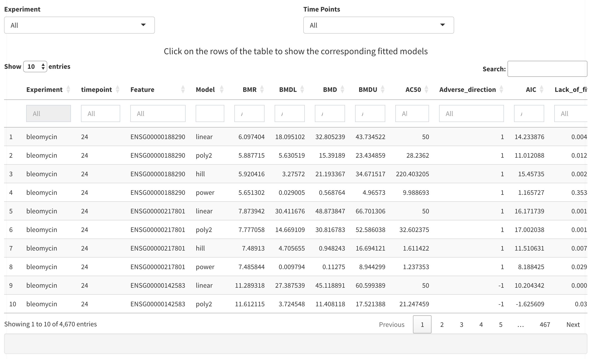
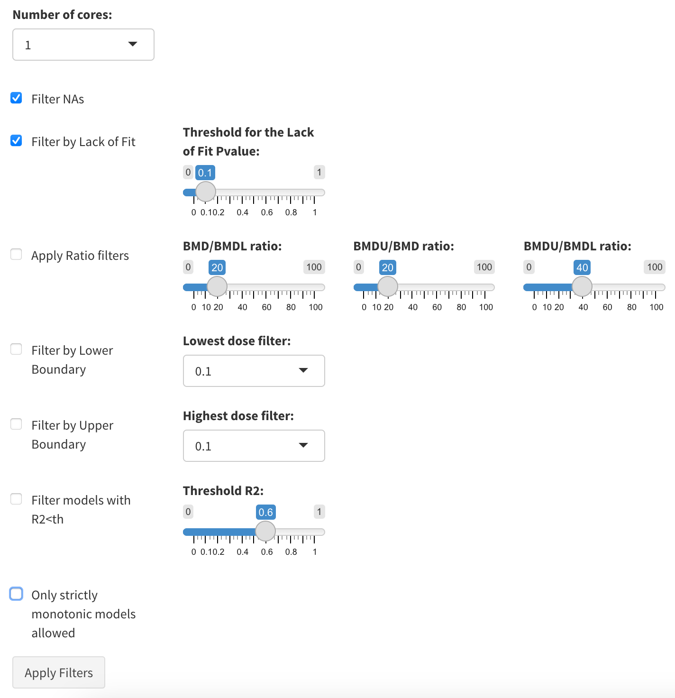
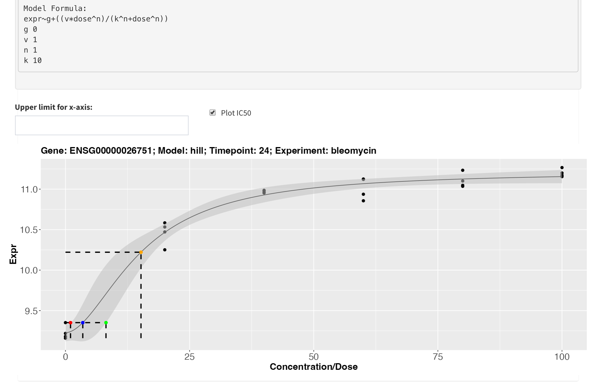

# BMD Results

The results of the BMD analysis will be reported in a tabular format with the following column names:

<!--  -->
<!--  -->

- **Experiment:**  The name of the experiment
- **time_point:** The time point of the experiment
- **Feature:** The name of the gene
- **Model:** The model fitted
- **BMR:** The expression of the gene at the response level
- **BMDL:** The estimated BMDL
- **BMD:** The estimated BMD
- **BMDU:** The estimated BMDU
- **AC50:** The estimated AC50
- **Adverse_direction:** Indicate if the model is increasing along the doses (+1) or decreasing (-1)
- **AIC:** The Akaike information criterion computed for the model
- **Lack_of_fit:** The lack of fit p-value
- **Log_likelihood:** The log-likelihood of the data given the model
- **R2:** The R2 square associated with the model
- **Residual_variance:** The variance of the residual represent differences between observed values and the values predicted by the model. It represents how much of the variability of response is not explained by the model.

The table reports all the models that can be estimated for every gene.

## Filtering BMD Results

The user can discard the model fitted and displayed in the BMD analysis result table by means of the following criteria:

- **Filter NAs:**  If selected, every model for which any of the estimated doses were not computed will be removed
- **Filter by lack-of-fit:**  If selected, every model for which any of the estimated doses were not computed will be removed
  - **Threshold for the lack-of-fit p-value** All models with lack-of-fit p-value lower than this threshold will be removed. Default = 0.1
- **Apply ratio filters:**  If selected, all models with BMD/BMDL or BMDU/BMD or BMDU/BMDL ration greater than the specified threshold will be removed
  - **BMD/BMDL ratio:** Default parameter set to 20
  - **BMDU/BMD ratio:** Default parameter set to 20
  - **BMDU/BMDL ratio:** Default parameter set to 40
- **Filter by lower boundary:**  If selected, models with estimated doses lower than a certain percentage of the lowest tested doses will be removed
  - **Lowest dose filter:** Default parameter set to 0.1, meaning that the model will be removed if it's effective doses are predicted to be lower that 10% of the lowest tested dose
- **Filter by upper boundary:**  If selected, models with estimated doses higher than a certain percentage of the highest tested doses will be removed
  - **Lowest dose filter:** Default parameter set to 0.1, meaning that the model will be removed if it's effective doses are predicted to be higher that 10% of the highest tested dose
- **Filter by R2:**  If selected, models with R2 lower than a certain threshold will be removed
  - **Threshold R2:** Default parameter set to 0.6.
- **only strictly monotonic models allowed**  If selected, only models that are strictly monotonic will be allowed.
- **No negative effective doses**  If selected, only models that do not have negative effective doses will be allowed.
- **No unordered effective doses**  If selected, only models that have effective doses ordered will be allowed.

## Selection of the optimal model

The selection of the final optimal model for every gene can be selected as the one with the lowest AIC value, or as the average consensus model. The consensus model should be computed only merging the models that pass the filtering criteria. 

## Visual investigation of the models

When clicking on a row of the BMD result table, the model fitted to the response data of the corresponding gene is visualized along with the corresponding effective doses. Furthermore the model formula with the estimated parameters are also visualised.  

