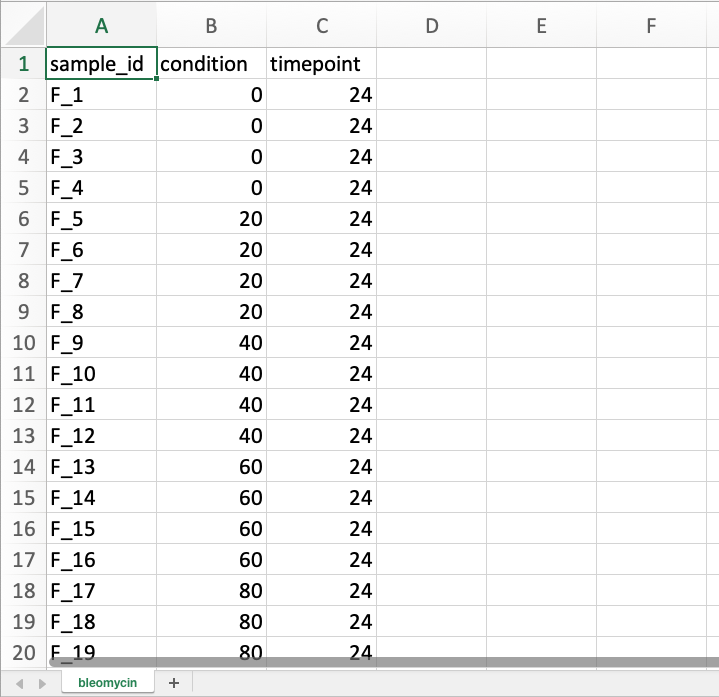
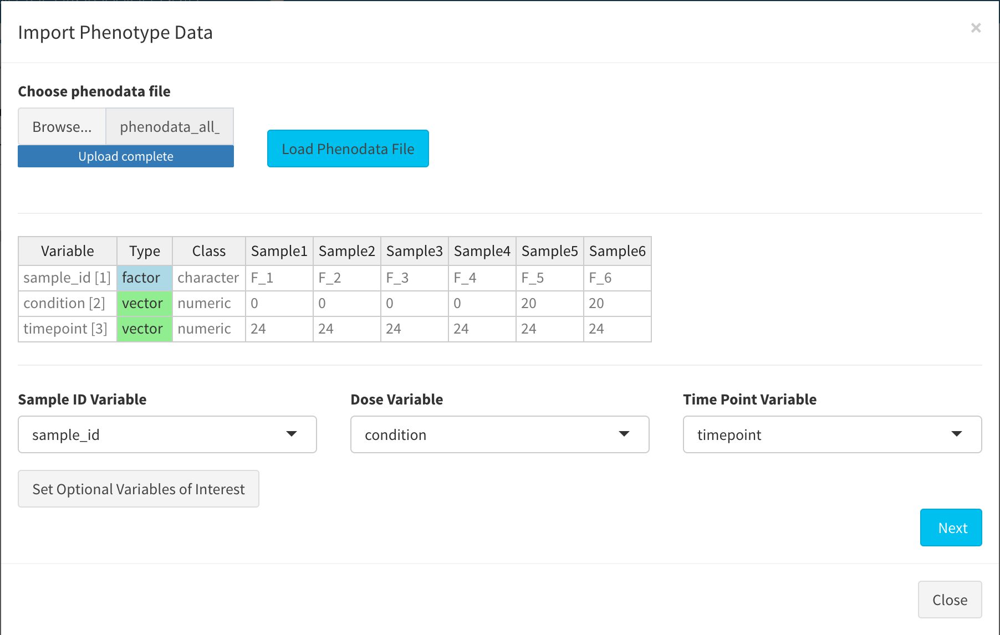
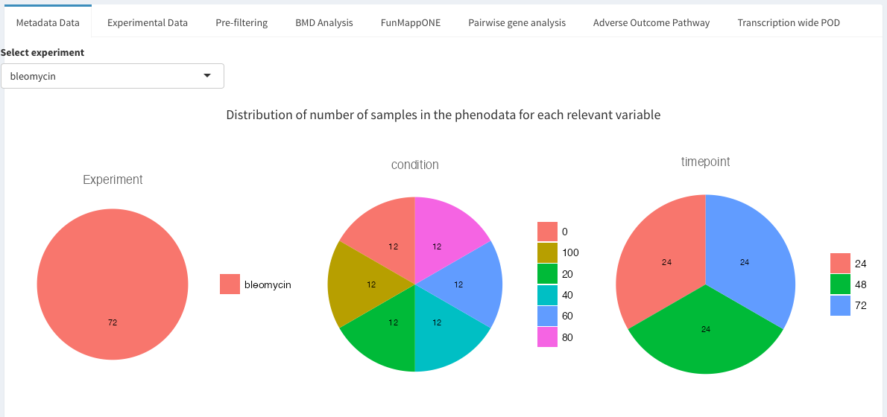
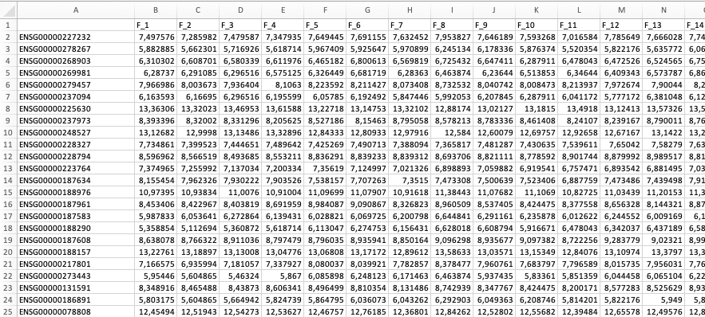
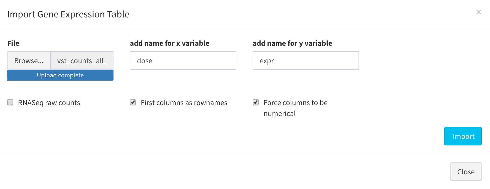
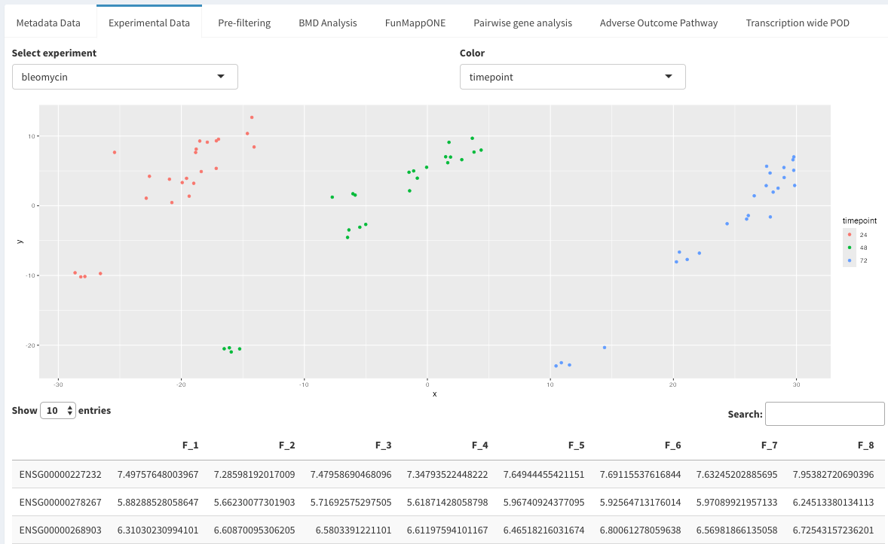

# Format of data input

BMDx takes as an input a phenotype file and an expression matrix, both provided as an Excel spreadsheet (xlsx). If multiple experiments are included, both files must contain separate sheets for each experiment in corresponding orders. Specific instructions for the file structures are provided below. Sample data can be found [here](https://github.com/Greco-Lab/BMDx).

## Phenodata
The phenotype file is an Excel file containing separate sheets for each experiment. Each sheet contains information about the samples used in the specific experiment. In particular, BMDx requires the spreadsheets to have at least three columns that specify the following characteristics: 1) Unique sample IDs corresponding to the column names in the expression matrix, 2) condition (e.g., dose) and 3) the time points included in the experiment. Each sheet must have the columns (sample ID, condition, and time point) in the same positions.

The required parameters are the following:

- **Path to pheno data file:** Browse and select the file from your local system
- **Sample ID variable:** Column name of the phenodata of the samples IDs
- **Dose variable:** Column name of the phenodata of the dose levels
- **Time point variable:** Column name of the phenodata of the time points
- **Optional variable:** Column names of the phenodata that can be used during the analysis to group the results

Once all options are set, load the phenotype data and proceed to the next step. 

An overview of the metadata is presented in the "Metadata data" window.

##  Expression data

The expression matrix is an Excel file with a separate sheet for each experiment. Each experiment involves a unique test system or materials being tested, such as different cell lines or treatments. Note that different doses or timepoints tested within the same system are not considered separate experiments. Sample columns are named with unique sample IDs that match the sample IDs provided in the phenotype file. Gene names must be provided in the first column of each spreadsheet, and each following column specifies the expression values for those genes in each individual sample. The order of the sheets must match the order of the sheets in the phenotype file.

The required parameters are the following:

- **Path to expression data file:** Browse and select the file from your local system
- **x:** Name of dose variable (default = "dose")
- **y:** Name of expression variable (default = "exp")

Once all options are set, import the normalized expression matrix and proceed to the next step. An overview of the gene expression matrix is presented in the "Experimental data" window.

