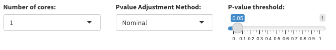
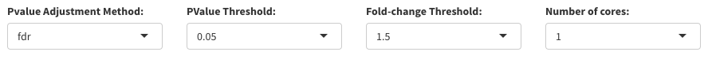

# Filtering

The number of genes (or molecules) profiled by transcriptomic data is usually high. Thus, in order to reduce the time of the BMDx analysis and focus on relevant genes, different filtering criteria are available:

- **ANOVA:** ANOVA is used to test the null hypothesis that the mean responses (e.g. expression of the genes) at the different doses are the same. The alternative hypothesis is that the response is different in at least one of the doses. If the p-value is below a certain threshold (e.g. 0.05) then we reject the null hypothesis that each dose mean response is the same. 
- **Mann-Kendall Trend test:** The Mann-Kendall Trend tests is performed under the null hypothesis that the data come from a population with independent realizations and are identically distributed. The alternative hypothesis is that the data follow a monotonic trend. If the p-value is below a certain threshold (e.g. 0.05) then the null hypothesis is reject and the response is considered to follow a monotonic trend. 
- **Filter by fold-change:** The filter by fold-change is performed by performing a limma analysis between the treated samples (all the different doses) against the controls of each individual time-point. Details on the limma package can be found [here](https://bioconductor.org/packages/release/bioc/html/limma.html).
- **Trend filtering:** It allows for filtering genes that do not exhibit a linear trend. For each data point and the next, you compute the derivative and ensure they all have the same sign. This method is less stringent than monotonic filtering, as monotonic filtering requires a consistent increase or decrease between consecutive points.

The user can also decide to skip the filtering.

## ANOVA and Trend test parameters

- **Pvalue adjustment method:** The adjustment method for the p-value. Possible values are "nominal", "fdr", "bonferroni" and "BH". See 
- **P-value threshold:** The threshold on the p-value used to reject the null hypothesis. Default = 0.05
- **Number of cores:** Number of cores used to perform the filtering. The number of scores affect the processing speed, as the quantity of cores directly impact the efficiency of the analysis.

## ANOVA and Trend test filtering Results

The results of the Anova and Trend test analysis will be displayed in a table with the following columns:
- **Exp:**  the name of the experiment
- **Time:** the time point of the experiment
- **Feature:** the name of the gene
- **Pvalue:** the p-value obtained from the analysis
- **adjPVal:** the adjusted p-values
- **usedFilteringPVal:** the p-value used to filter the results. If the adjustment is performed, usedFilteringPVal will be equal to adjPVal, otherwise will be equal to Pvalue.

## Fold-change filtering parameters

- **Pvalue adjustment method:** The adjustment method for the p-value. Possible values are "nominal", "fdr", "bonferroni" and "BH". Nominal means no adjustment will be performed. 
- **Pvalue threshold:** The threshold on the p-value used to reject the null hypothesis. Default = 0.05
- **Fold-change threshold:**: The minimum fold-change to consider a gene differentially expressed (default 1.5)
- **Number of cores:** Number of cores used to perform the filtering

## Fold-change filtering results

The results of the filtering by fold-change will be displayed in a table with the following columns:

- **Exp:**  the name of the experiment
- **Time:** the time point of the experiment
- **Feature:** the name of the gene
- **logFC:** the name of the gene
- **P.value:** the pvalue obtained from the analysis
- **adj.P.Val:** the adjusted pvalues
- **useddFilteringPVal:** the pvalue used to filter the results. If the adjustment is performed, useddFilteringPVal will be equal to adj.P.Val, otherwise will be equal to P.value

