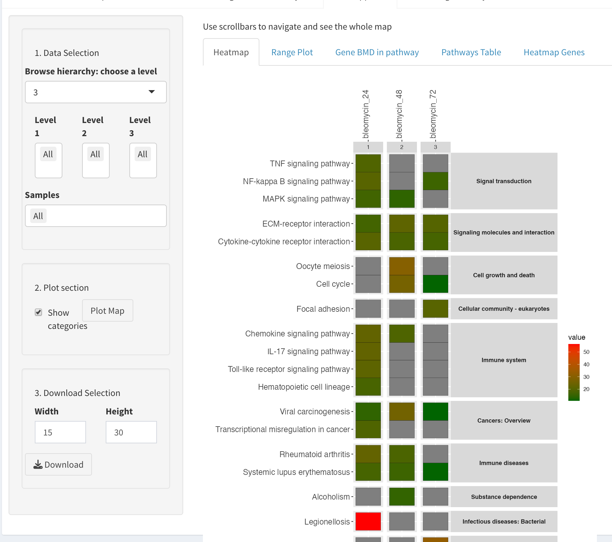
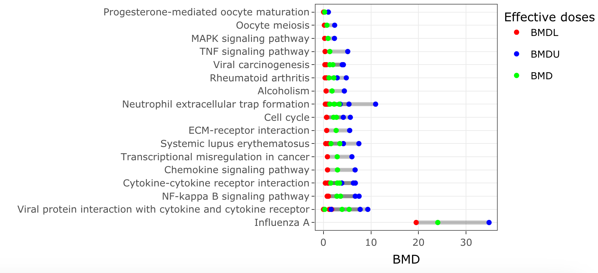
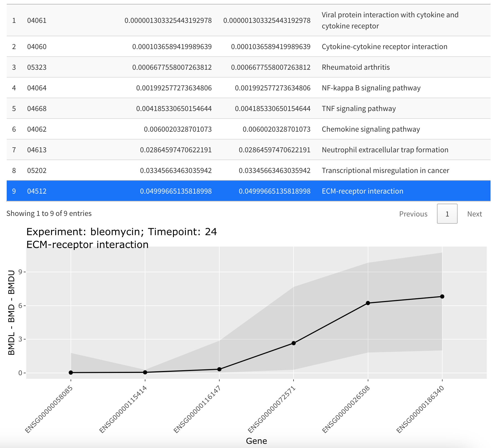
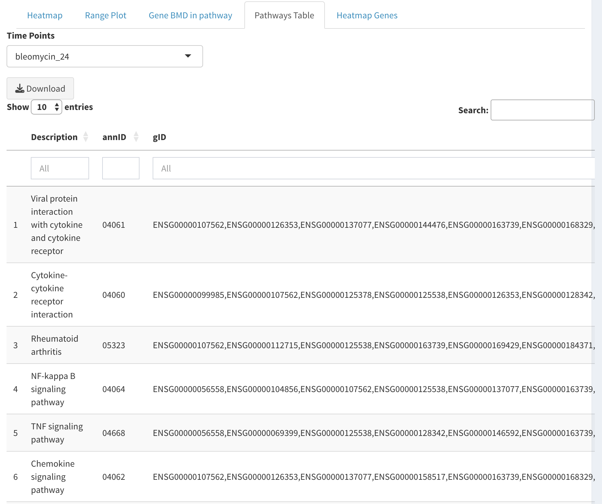
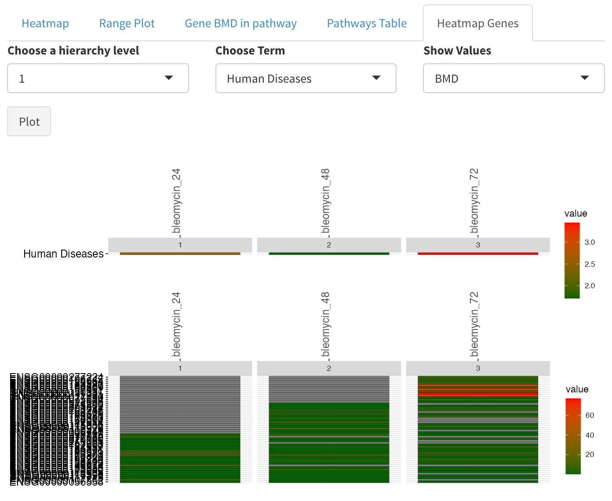

# FunMappOne enrichment analysis 

FunMappOne is a user friendly tool for the comparison of functional enrichment analysis af multiple experiments. 
The tool is publicly available [at](https://github.com/Greco-Lab/FunMappOne). Please refer to the FunMappOne paper for more [details](https://bmcbioinformatics.biomedcentral.com/articles/10.1186/s12859-019-2639-2).

The FunMappOne tools is embedded into the BMDx as a module for the functional characterization of the dose-dependent genes.

### Heatmap visualization

Once the FunMappOne analysis is performed a heatmap with the enrichment results for each experiment is visualized. 
The enrichment heatmap shows each time point in each experiment as a separate column. Pathways are shown in the rows, and coloured boxes indicate enrichment of the pathway at the specific condition. When plotted values are shown in chromatic scale, the colour of the box changes according to the value. For example, in the figure below, the colour indicates the mean BMD value of the genes contributing to the enrichment of the pathway, showing the difference in the BMD values between the two experiments.

### Range plot

A range plot can be visualised to show the span of values of the BMDL, BMD and BMDU of the different enriched pathways. The following parameters are required:

- **Groupd by X:** the pathways can be grouped by a factor variable
- **Numeric grouping variable:**: If true the variable is considered numerical and ordered accordingly 
- **Other variables (optional):** the pathways  can be grouped by another optional factor variable to perform a grid plot
- **Filter by Column:** Can be used to investigate the bmd distribution of specific variable of interest. Default is None which means that no filtering is applied. However, if one of the column names is selected the **Filter by Column Values** window is populated by the possible column values. When one of those is selected, only the bmd corresponding to the genes characterized by those values are investigated (e.g. only the bmd produced by a specific model).

### Gene BMD in pathway

Gene BMD in a Pathway tab shows all pathways with their enrichment p-values. Selecting a row
of the table plots a graph under the table with all the genes in the pathway, their BMD values as
well as the lower and upper confidence bound BMD. Note! Deselect the row before selecting the
next row to only include the genes in the desired pathway.

### Pathways Table

The genes mapped to each term are shown as a table in Pathways table tab. Time point for which
data is shown can be changed from the time point drop menu. The tables can be downloaded as a
single Excel file by clicking download. 

### Heatmap Genes

Finally, the genes in different pathways can be explored in the form of a heatmap. The drop menus allow for the specification of the hierarchy level, the terms belonging to that level and specification of values shown on the heatmap. The heatmap then shows the genes mapped to the selected term on rows with the experiments and time points as columns, and coloured boxes indicating the value specified in the Show values drop menu.

