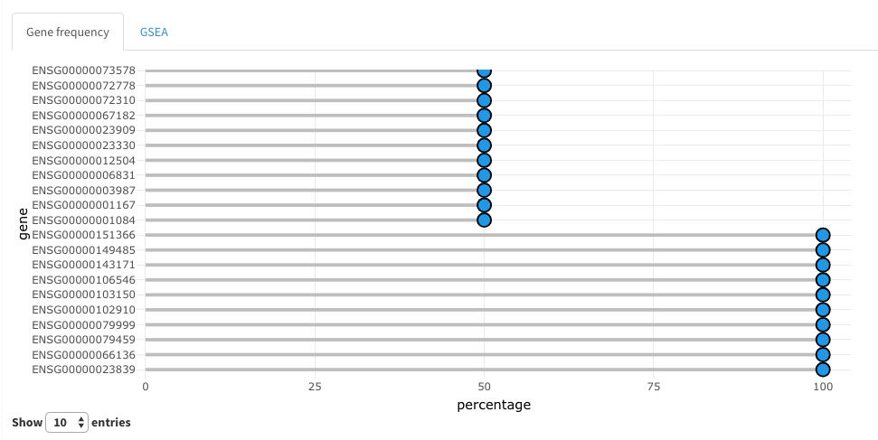
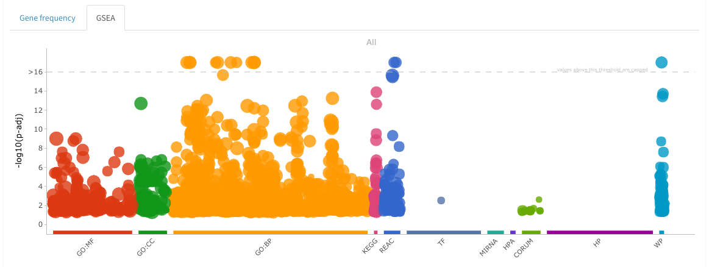

# Gene frequency analysis

The aim of this analysis is to identify genes who are more often dose-dependent across different experiments or time points.
The genes are ranked according to their occurrence frequency across the different experiments. Genes with a frequency below a certain threshold can be removed from the analysis. The tool compute the frequencies of the genes and plots them using a horizontal barplot, where genes are ranked based on their frequency. A GSEA is performed by means of the gprofiler package on the ranked list of genes.

The following parameters are required:

- **Main grouping variable:** Use to group the samples into categories. Gene frequency will be computed accordingly.
- **Second grouping variable:** Use to group the samples into categories. Gene frequency will be computed accordingly.
- **Threshold:**: Used to filter out genes with low frequency. E.g. if 50% is selected, the genes with frequency below this number will not be included in further analysis
- **Organism:** to be specified for the GSEA analysis. Available organisms are human, mouse and rat.  
- **Correction method:** Is the correction method applied to the GSEA p-values
- **Choose split:** If a split is performed this parameter can be used to show the GSEA results of the specific subset of samples

