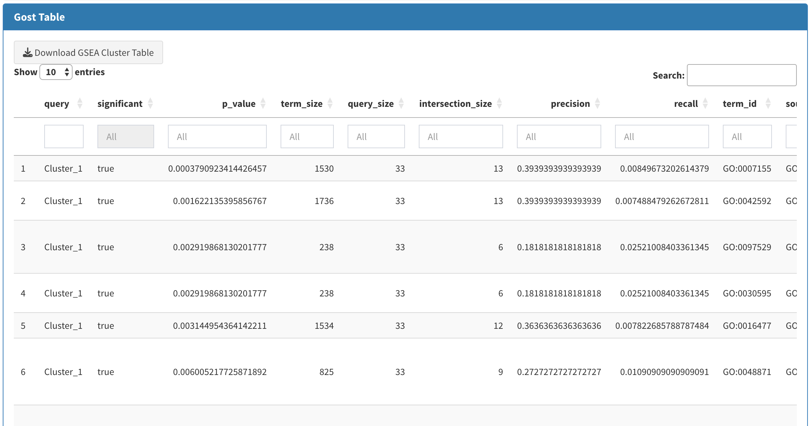
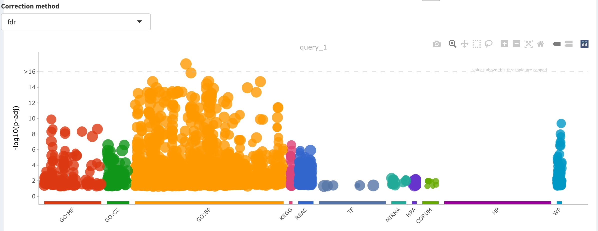

# Compare gene pairs profile across doses
This analysis is used to compare the expression profiles of pairs of genes across the doses. Users can filter by specific columns, experiments, and timepoints.
Given the optimal model fitted to every gene, N predicted expression values are computed. These are used to compute the Pearson correlation between each pair of genes. 
The parameters required for the analysis are the following:

- **Number of predictions:** The number of predicted values for each gene. Default = 1000
- **Number of cores:** The number of cores used for the analysis
- **Organism:** The organism for which the expression values have been computed (available values are human, mouse and rat) 

The result of the analysis are visualized in a tabular format with the following columns:

- **Filter by Column:** Fixed to "Experiment"
- **Filter by Experiment:** Used to select the experiment for which the correlation will be computed.
- **Filter by Time Point:** Used to select the time point for which the correlation will be computed.
- **Feature 1:** Name of the first gene
- **Model 1:** Optimal fitted model for the fist gene
- **Feature 2:** Name of the second gene
- **Model 2:** Optimal fitted model for the second gene
- **Pearson Correlation:** Correlation between the pairs of gene

Furthermore the genes will be clustered by performing a hierarchical clustering on top of the correlation matrix. For this the **Number of clusters** parameter is required. Default value = 2. The clustering also includes annotations related to network properties of those genes within the PPI, such as degree, closeness, and eigenvector, as well as information on whether a gene is a transcription factor (TF) or a microRNA.

Genes belonging to each cluster can be visualized as a table.

For each cluster, an enrichment analysis will be performed by means of the R package gprofiler2. For this the **Correction method** parameter is required. Default value = "fdr". Enrichment results can be visualized in a gost plot or bubble plot.

Enrichment results can be visualized and exported as a table.

## Gene Sets
For all the statistically significant pathways identified with the FunMappOne tool or KE enrichment for the selected experiment and time point, the gene expression profile of the genes annotated in the pathways can be plotted and compared.

User can also visualize how these genes are associated to each other within the PPI, taking into account their properties (degree and closeness) and characteristics, such as whether they are TF or miRNA.

## PPI analysis
The PPI network of the selected organism (human, mouse, or rat) will be used to analyse the pairs of correlated genes. A subgraph of the PPI network is created by selecting all the edges incident on pairs of correlated genes. The genes in the subgraph are ranked according to their degree (number of edges incident on the node). The gprofiler2 package is used to perform a GSEA analysis over the genes ranked by degree centrality.

The parameters used for this analysis are the following:
- **Correlation interval:** Used to filter pairs of genes with correlation under this threshold
- **Correction method:** Method used to correct the p-value of the GSEA analysis

